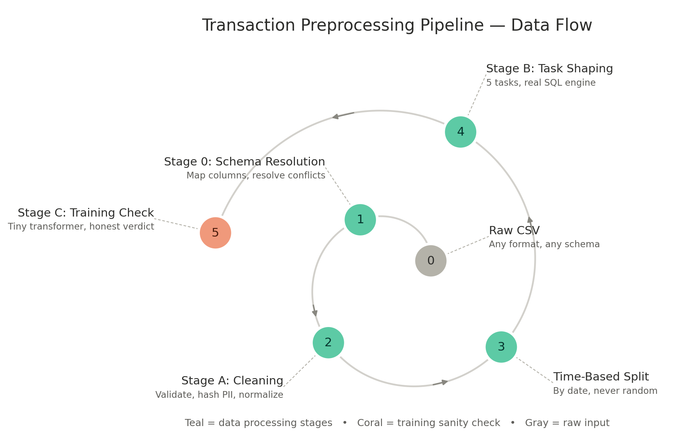

# Universal Transaction Preprocessing Pipeline — Project Documentation

**Current version: v13**

## What this is

A pipeline that turns **arbitrary raw transaction CSVs** into **clean, task-shaped, LLM-fine-tuning-ready data**, with a Streamlit UI for reviewing and controlling every stage. Built around one core principle: **automate aggressively, but never silently** — every assumption the pipeline makes is logged, flagged, or requires explicit confirmation, so "automated" never means "untrustworthy black box."

---

## Architecture: Four Stages



```
Raw CSV -> [Stage 0: Schema Resolution] -> [Stage A: Cleaning] -> [Stage B: Task Shaping] -> [Stage C: Training Sanity Check]
```

### Stage 0 — Schema Resolution
Maps arbitrary column names to a fixed **canonical schema** of 9 fields.

**The 9 canonical fields:**

| Field | Required? | Default if missing |
|---|---|---|
| `entity_id` | Yes | (pipeline halts without it) |
| `timestamp` | Yes | (pipeline halts without it) |
| `amount` | Yes | (pipeline halts without it) |
| `currency` | No | `"USD"` |
| `category` | No | `"UNKNOWN"` |
| `channel` | No | `"UNKNOWN"` |
| `counterparty` | No | `"UNKNOWN"` |
| `status` | No | `"COMPLETED"` |
| `label` | No | `None` |

**Resolution is a two-pass, confidence-ordered process** (not simple column order):
1. Pass 1: every strong name-based match (exact alias, or fuzzy match confirmed by content) claims its field first, strongest confidence globally wins, regardless of column order in the file.
2. Pass 2: remaining unclaimed fields get filled by weaker content-only inference.

**Collision handling**: if two columns both achieve a strong name-based match for the same canonical field, the losing column gets a distinct status and a specific note explaining what happened, instead of disappearing into the generic quarantined bucket with no explanation.

**When automation can't confidently resolve a required field**, or an important optional one (`category`, `label`), the UI pauses and asks for a manual mapping rather than guessing or defaulting silently.

**Entity_id special case**: if no account/customer column exists, you can explicitly opt into auto-indexing (each row becomes its own entity), gated behind a confirmation checkbox since it collapses entity-level sequencing to length 1.

**Quarantined columns** are not "judged useless" - just schema-incompatible. Any can be opted back in as extra unhashed context.

### Stage A — Canonical Cleaning
- **Validation gate**: drops rows missing required fields, removes duplicates, with a per-field null-count breakdown.
- **PII hashing**: `entity_id` and `counterparty` are one-way salted-hashed immediately.
- **Amount normalization**: distinguishes European (`1.234,56`) from US (`1,234.56`) formatting by checking which separator appears last, rather than naively stripping commas (which would silently produce a wrong number). Also handles currency symbols/codes, accounting parentheses, and trailing-minus notation.
- **Date normalization**: resolves day-first vs month-first ambiguity with a logged confidence assumption; safe against mixed timezone-aware/naive values in one column.
- **Causal feature engineering**: day-of-week, hour-of-day, time-since-last-transaction, rolling average - strictly causal, no future leakage.
- **Duplicate-column defense**: any accidental duplicate canonical column is caught, deduplicated, and logged rather than allowed to crash downstream.

### Time-based Train/Val/Test Split
Never random. Earliest data trains, most recent tests. Held-out test defaults on for fraud flagging, categorization, and NL-to-SQL; off for summarization and general behavioral (mostly qualitative eval) - toggleable either way.

### Stage B — Task-Aware Shaping

| Task | Needs a label? | What it teaches |
|---|---|---|
| Fraud flagging | Yes (`label`) | Judge a transaction given recent history |
| Categorization | Yes (`category`) | Classify a single transaction |
| Spend summarization | No | Phrase pre-computed facts into a narrative |
| General behavioral | No | Model the raw sequence (continued-pretraining style) |
| Natural-language query (NL to SQL) | No | Translate a question into a SQL query |

Serialization is structured-but-textual, not prose, to preserve numeric precision and avoid wasted tokens. Categorization excludes its own target field from context to avoid trivial leakage.

### The Query Engine (NL-to-SQL + Fact-Grounded Summarization)

**Core design decision**: rather than having an LLM compute answers directly, the pipeline builds a real SQLite database from the cleaned data and uses a retrieve-then-generate pattern - the model translates questions into SQL (or phrases pre-computed facts), and a real query engine computes the actual answer.

**Template families** (instantiated against this dataset's actual data, not a fixed list): aggregation, extremes, comparison, retrieval.

Every generated query is **executed against real data and validated before being kept** - a query that errors or returns nothing meaningful is dropped. Result formatting matches the result's real type (a COUNT renders as a plain integer, not `"12.00"`), and time-window scope is checked against what each template actually measures, after a real bug where refund-only months could generate misleadingly "0 transactions" examples.

**Honest limitation**: the query engine must be available at inference time too - the model alone only produces SQL, not a final answer. Query scope is per-entity ("my spending"), not cross-entity analyst queries.

### Stage C — Training Sanity Check
A small transformer - genuine self-attention, feed-forward, residual connections, intentionally small - trained **from scratch in pure NumPy** (no PyTorch, no internet, no pretrained weights) directly on categorization output, to check the shaped data has real learnable signal.

Backpropagation was verified against numerical gradient checking before trusting it on real data. Diagnostics include a majority-class baseline (not just random-guess), train-vs-validation accuracy (overfitting check), per-class accuracy breakdown (catches a model that's good overall but fails completely on rare categories), a small-sample warning, and an explicit verdict rather than raw numbers left to be eyeballed.

---

## Data Quality: Adversarial Testing

An independently-designed, deliberately messy stress-test CSV - covering date/amount format chaos, boolean and entity-ID representation chaos, merchant-name edge cases, and structural CSV malformation - was run through the pipeline with zero prior tuning, specifically to find gaps rather than confirm known-working paths. This found and fixed:
- Two unhandled crashes (mixed timezone timestamps; a fragile heuristic that mistook the word "Travel" for a date)
- One silent-wrong-data bug (European-format amounts parsed to the wrong number, not dropped - the more dangerous failure mode)
- One overly brittle upload path (one malformed row rejecting an entire otherwise-valid file)

Kept as a permanent regression fixture at `test_fixtures/messy_transactions_stress_test.csv`.

---

## The Manifest

Every run produces `manifest.json` - the full audit trail of every automated decision: schema mapping with confidence scores, convention assumptions, cleaning stats with per-field null breakdowns, split boundaries, and a warnings list covering anything worth a second look. Nothing the pipeline decides on your behalf is invisible.

---

## Known, Deliberate Limitations

- Spend summarization / general_behavioral default to train/val only (qualitative eval) - toggleable.
- NL-to-SQL scope is per-entity, not cross-entity analyst queries.
- NL-to-SQL template coverage, while combinatorial, is finite.
- Currently in-memory/single-process (Streamlit + pandas) - comfortable to tens of MB; larger files need an architectural scale-up.
- Opted-in extra context columns bypass PII hashing - intentional, clearly warned.
- Excel serial dates / Unix epoch timestamps in numeric columns aren't auto-detected.
- Fully ambiguous all-numeric dates can resolve inconsistently - a genuine source-data ambiguity, not a pipeline defect.

---

## Version History

| Version | Key additions / fixes |
|---|---|
| v1 | Core pipeline, Streamlit UI, two synthetic test providers with different schemas |
| v2 | File upload; task-aware split defaults |
| v3 | Two-pass confidence-ordered schema resolver |
| v4 | Opt-in extra context columns |
| v5 | Manual mapping for category/label; confidence summary; field override tool; Stage C diagnostics |
| v6 | NL-to-SQL task; fact-grounded summarization |
| v7 | Fixed: field override could leave a duplicate column, crashing SQLite export |
| v8 | Dashboard summary card |
| v9 | Architecture diagram |
| v10 | Adversarial stress test: fixed 2 crashes, 1 silent-wrong-data bug, 1 brittle upload |
| v11 | Fixed a second, different root cause of the duplicate-column crash |
| v12 | Fixed a confusing silent mapping collision; general collision-detection safeguard |
| v13 (current) | Fixed COUNT formatting; fixed misleading "0 transactions" scope-mismatch bug |

---

## File Structure

```
txn_pipeline/
├── app.py
├── data_synth.py
├── docs/pipeline_spiral.png
├── test_fixtures/
├── pipeline/
│   ├── schema.py
│   ├── schema_resolution.py
│   ├── cleaning.py
│   ├── splitting.py
│   ├── shaping.py
│   ├── query_engine.py
│   ├── nl_to_sql.py
│   ├── summarization_v2.py
│   ├── tiny_transformer.py
│   ├── manifest.py
│   └── orchestrator.py
└── requirements.txt
```

## Setup

```bash
pip install -r requirements.txt
streamlit run app.py
```

## Using the pipeline on your own data (no UI)

```python
import pandas as pd
from pipeline import run_pipeline

df = pd.read_csv("your_transactions.csv")
result = run_pipeline(df, source_name="my_source", task_types=["fraud_flagging", "query_sql"])

if result["fatal_error"]:
    print("Pipeline halted:", result["fatal_error"])
else:
    examples = result["shaped_outputs"]["query_sql"]
    manifest = result["manifest"].to_dict()
```
